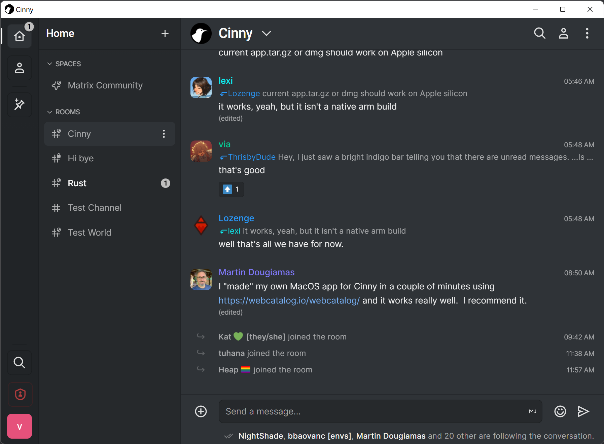

# Cinny desktop
Dekstop app of Cinny made with Tauri. Cinny is a matrix client focusing primarily on simple, elegant and secure interface.

## Local development

Firstly, to setup Rust, NodeJS and build tools follow [Tauri documentation](https://tauri.studio/docs/getting-started/prerequisites).

Now, to setup development locally run the following commands:
* `git clone --recursive https://github.com/cinnyapp/cinny-desktop.git`
* `cd cinny`
* `npm ci`
* `cd ..`
* `npm ci`

To build the app locally, run:
* `npm run tauri build`

To start local dev server, run:
* `npm run tauri dev`